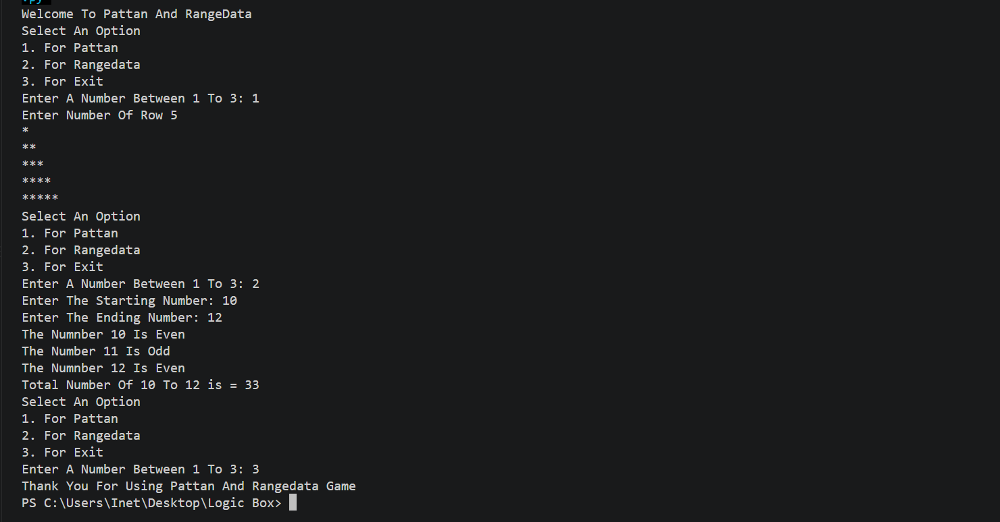

# Pattern and Number Analyzer

## Subtitle of the Project

A simple Python program that generates a star pattern and analyzes numbers within a given range.

## About the Project

This project is a beginner-friendly Python program that provides an interactive menu to the user.

The program allows the user to select from the following options:

* Generate a star pattern based on the number of rows entered by the user.
* Analyze a range of numbers and determine whether each number is even or odd.
* Calculate the sum of all numbers within the selected range.
* Exit program.

The program continues displaying the menu until the user chooses the Exit option.

## Output



## Features

* Displays an interactive menu.
* Generates a right-angled star pattern.
* Takes the number of rows from the user.
* Checks whether numbers are even or odd.
* Takes a starting and ending number for the range.
* Calculates the sum of numbers in the given range.
* Uses loops and conditional statements.
* Allows the user to exit the program.

## Technology Used

* Python
* Visual Studio Code (VS Code)
* Git

## How to Run

### Step 1: Install Python

```bash
https://www.python.org/downloads/
```
### Step 2: Run the Program

```bash
python main.py
```

## Project Structure
```text
│
├── main.py
├── output.png
└── README.md
```
## Learning Objectives

By completing this project, you can learn:

* How to take input from the user in Python.
* How to use variables.
* How to use if, elif, and else statements.
* How to use for and while loops.
* How to generate patterns using loops.
* How to check whether a number is even or odd.
* How to calculate the sum of numbers in a range.
* How to create a menu-driven Python program.
* How to control program flow based on user choices.
* How to use VS Code for Python development.
* How to use Git for version control.

## Author
Bhavya Sahetiya